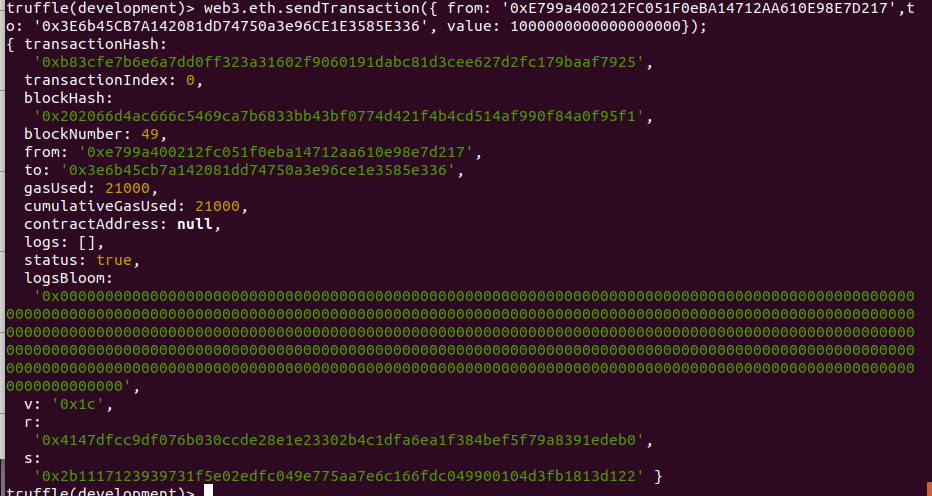

**PEC1 - DISEÑO Y DESARROLLO 1**

**José Redondo Hurtado**

**EJERCICIO 2**

> personal.newAccount("hello world")
"0xf64c60f07e6639071e6e011723fcc427bbec837b"

> eth.sendTransaction({from:"0xf7bef114a8653f67ca8dc5450bb8f5b9c3fa08c1", to:"0xf64c60f07e6639071e6e011723fcc427bbec837b", value:1000000000000000000})

> web3.eth.sendTransaction({ from: '0xE799a400212FC051F0eBA14712AA610E98E7D217',to: '0x3E6b45CB7A142081dD74750a3e96CE1E3585E336', value: 1000000000000000000});

