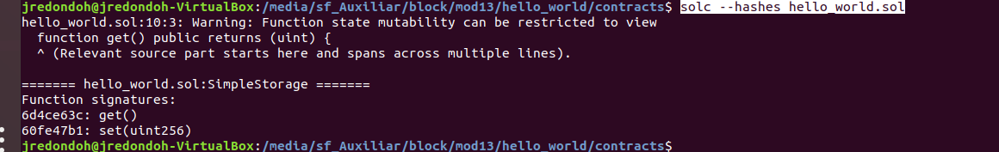

**PEC1 - DISEÑO Y DESARROLLO 1**

**José Redondo Hurtado**

**EJERCICIO 4:**

Códigos de operación del contrato inteligente

> solc --opcodes --optimize hello_world.sol

 Identificadores de las funciones que existan dentro del contrato inteligente.

> solc --hashes hello_world.sol

	"6d4ce63c": get(),
	"60fe47b1": set(uint256)

Estimación del gas utilizado por cada función
    
> solc --gas --optimize hello_world.sol

    get(): 398 gas
    set(uint256): 20167 gas,

