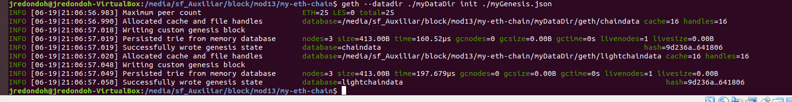
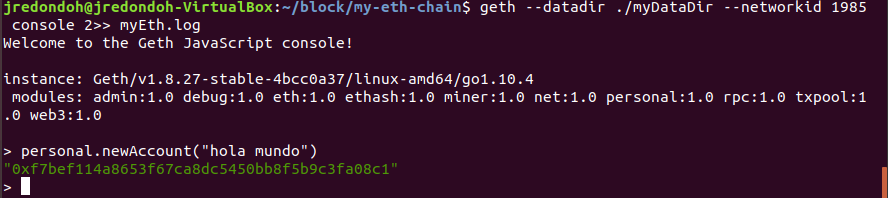
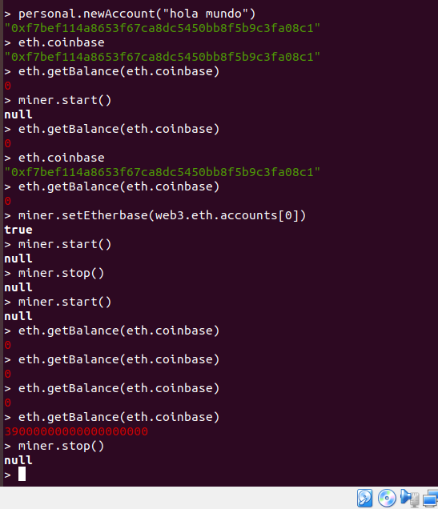
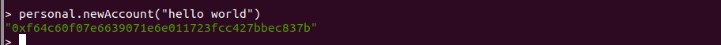
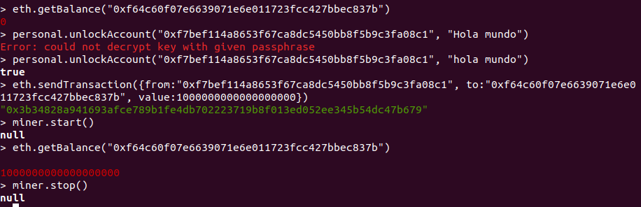
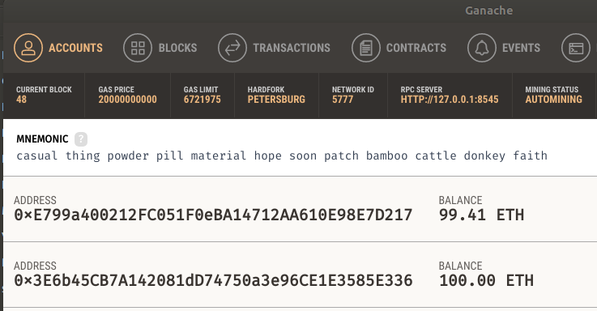
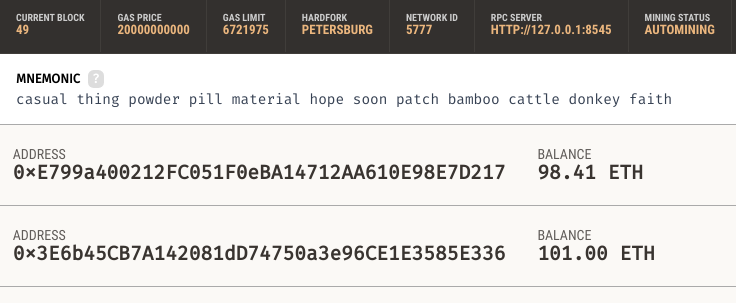
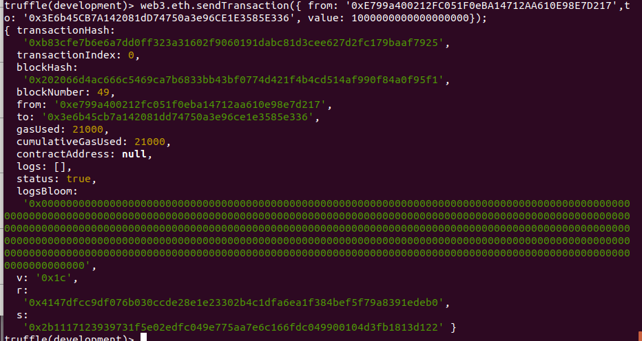
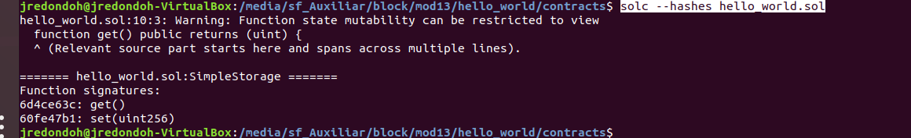

**PEC1 - DISEÑO Y DESARROLLO 1**

**José Redondo Hurtado**

**EJERCICIO 1**

> geth --datadir ./myDataDir init ./myGenesis.json

> geth --datadir ./myDataDir --networkid 1985 console 2>> myEth.log

para crear un nodo, he tenido que cambiar el path de la carpeta ya que:
https://github.com/ethereum/go-ethereum/issues/16342 

En la consola de geth:

> personal.newAccount("hola mundo")

    "0xf7bef114a8653f67ca8dc5450bb8f5b9c3fa08c1"

> miner.start()

> eth.getBalance(eth.coinbase)

> miner.stop()

**EJERCICIO 2**

> personal.newAccount("hello world")
"0xf64c60f07e6639071e6e011723fcc427bbec837b"

> eth.sendTransaction({from:"0xf7bef114a8653f67ca8dc5450bb8f5b9c3fa08c1", to:"0xf64c60f07e6639071e6e011723fcc427bbec837b", value:1000000000000000000})

> web3.eth.sendTransaction({ from: '0xE799a400212FC051F0eBA14712AA610E98E7D217',to: '0x3E6b45CB7A142081dD74750a3e96CE1E3585E336', value: 1000000000000000000});

**EJERCICIO 3**

https://gist.github.com/cryptogoth/10a98e8078cfd69f7ca892ddbdcf26bc 
 - Obtenga el address correspondiente al bloque génesis de la red Rinkeby mediante
la consola del cliente Geth y demuestre cómo lo ha obtenido. No use la función
getBlock(...)​.
> admin.nodeInfo.protocols.eth.genesis

    "0x6341fd3daf94b748c72ced5a5b26028f2474f5f00d824504e4fa37a75767e177"

- Obtenga sólo la cantidad de peers a los que está conectado. Demuestre cómo lo
ha obtenido.
> net.listening

    true

> net.peerCount

    1

- Obtenga información acerca de los peers a los que está conectado e indique el
hash del bloque actual de éstos.

Para el primero (y único) de mis peers:
> admin.peers[0]

- Añada manualmente mediante la consola de Geth un ​bootnode​ de la red Rinkeby

https://github.com/ethereum/go-ethereum/blob/79b11121a7e4beef0d0297894289200b9842c36c/params/bootnodes.go#L23 

Cojo uno de Rinkeby
"enode://a24ac7c5484ef4ed0c5eb2d36620ba4e4aa13b8c84684e1b4aab0cebea2ae45cb4d375b77eab56516d34bfbd3c1a833fc51296ff084b770b94fb9028c4d25ccf@52.169.42.101:30303" 
> admin.addPeer("enode://a24ac7c5484ef4ed0c5eb2d36620ba4e4aa13b8c84684e1b4aab0cebea2ae45cb4d375b77eab56516d34bfbd3c1a833fc51296ff084b770b94fb9028c4d25ccf@52.169.42.101:30303")

**EJERCICIO 4:**

Códigos de operación del contrato inteligente

> solc --opcodes --optimize hello_world.sol

 Identificadores de las funciones que existan dentro del contrato inteligente.

> solc --hashes hello_world.sol

	"6d4ce63c": get(),
	"60fe47b1": set(uint256)

Estimación del gas utilizado por cada función
    
> solc --gas --optimize hello_world.sol

    get(): 398 gas
    set(uint256): 20167 gas,

**EJERCICIO 5:**

- function sumValues (uint _a, uint _b) public view returns (uint _c) {}
- function getGasDetails() public payable{}
- function __callback(bytes32 id, string memory result) public{}
- function jrh(uint8 _a, address _address) internal{}

Para calcularlos se ejecuta la función hash Keccak-256 (SHA-3), yo usé una función online para calcular este hash (http://emn178.github.io/online-tools/keccak_256.html), sobre:
- el nombre de la función
- su tipo de parámetros, sin espacios
- usar solamente los 4 primeros bytes. 

Por lo tanto para las funciones propuestas lo calculamos sobre:

sumValues(uint,uint)

    06cbb876

getGasDetails()

    3d86f4af

_callback(bytes32,string)

    cee77be9

jrh(uint8,address)

    fd0498f3
