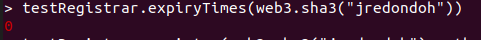
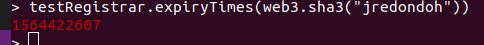
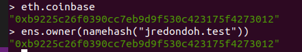
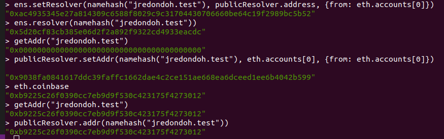

Ejercicio 1 - ENS (1 punto)

Basándome en:

https://michalzalecki.com/register-test-domain-with-ens/

Primero lanzo el nodo de Ethereum conectado a Rinkeby.
> geth --rinkeby --syncmode "fast" --rpc --rpcport 33000 --rpccorsdomain "*" --rpcaddr "127.0.0.1" --rpcapi "db,eth,net,web3,personal"

Luego me conecto al nodo con:
> geth attach http://127.0.0.1:33000

Y ya en la consola, cargo el fichero ensutils-rinkeby.js, que es el fichero ensutils-testnet.js, pero con la dirección de ENS modificada para apuntar a la de Rinkeby.

> loadScript("./ensutils-rinkeby.js")

Después compruebo que mi dirección deseada no está registrada:

El tiempo de expiración que me devuelve es 0, por lo que está libre.

Con la dirección personal de Rinkeby desbloqueada y con fondos obtenidos del faucet, ejecuto:
> testRegistrar.register(web3.sha3("jredondoh"), eth.accounts[0], {from: eth.accounts[0]})

Obteniendo como resultado una transacción de la cadena Rinkeby.
Cuando esa transacción es minada, compruebo que la dirección registrada ya no tiene un Expiry time de 0.

Y que el dueño de esa dirección es mi dirección.

Utilizando el resolver público ubicado en 0x5d20cf83cb385e06d2f2a892f9322cd4933eacdc.

Asigno primero mi dirección a ese resolver, luego hago que la dirección apunte a mi dirección.

